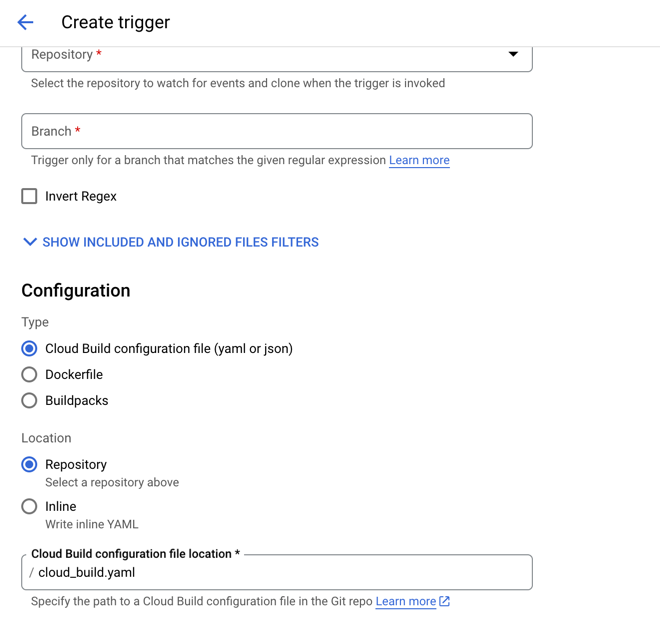
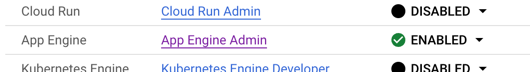

# Google Cloud Build template (vite)

1. Создать репозиторий в GC и привязать его к гитхабу
2. Добавить триггер и указать environment variables

3. Убедиться, что все permissions активированы

4. Активировать "App Engine Admin API" и "Cloud Deployment Manager V2"
